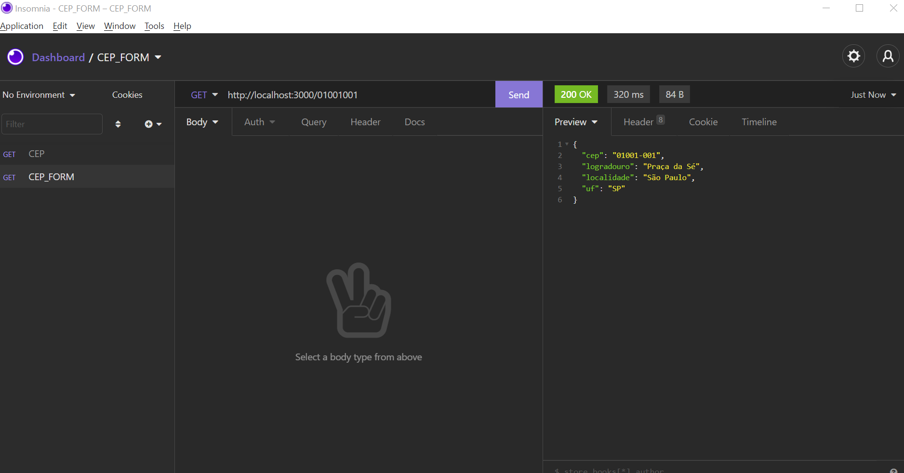

# BACKEND - CEP_FORM

> README com instruções de como rodar o backend do projeto.

## Table of Contents

- [General Info](#general-information)
- [Technologies Used](#technologies-used)
- [Features](#features)
- [Screenshots](#screenshots)
- [Setup](#setup)
- [Usage](#usage)
- [Project Status](#project-status)
- [Room for Improvement](#room-for-improvement)
- [Acknowledgements](#acknowledgements)
- [Contact](#contact)
<!-- * [License](#license) -->

## General Information

- Projeto de backend simples com o intuito de rodar uma API local,
  que faz uma consulta na no endpoint: http://viacep.com.br/ws/ ,
  faz um parse da resposta e disponibiliza um resumo das informações.

## Technologies Used

---PRO---

- NODE - version 14.18.0
- AXIOS - version ^0.23.0
- CORS - version ^2.8.5
  ---DEV---
- EXPRESS - version ^4.17.1
- JEST - version ^27.2.5
- JEST-CLI - version ^27.2.5
- NODEMON - version ^2.0.13
- SUPERTEST - version ^6.1.6

## Screenshots

## Setup

Primeiramente é necessário baixar o projeto e do GitHub em sua maquina local  
HTTPS - `git clone https://github.com/caiqueubasp/cep_form.git`  
SSH - `git clone git@github.com:caiqueubasp/cep_form.git`  

## Usage

How does one go about using it?
Provide various use cases and code examples here.

`write-your-code-here`

## Project Status

Project is: _in progress_ / _complete_ / _no longer being worked on_. If you are no longer working on it, provide reasons why.

## Room for Improvement

Include areas you believe need improvement / could be improved. Also add TODOs for future development.

Room for improvement:

- Improvement to be done 1
- Improvement to be done 2

To do:

- Feature to be added 1
- Feature to be added 2

## Acknowledgements

Give credit here.

- This project was inspired by...
- This project was based on [this tutorial](https://www.example.com).
- Many thanks to...

## Contact

Created by [@flynerdpl](https://www.flynerd.pl/) - feel free to contact me!

<!-- Optional -->
<!-- ## License -->
<!-- This project is open source and available under the [... License](). -->

<!-- You don't have to include all sections - just the one's relevant to your project -->
