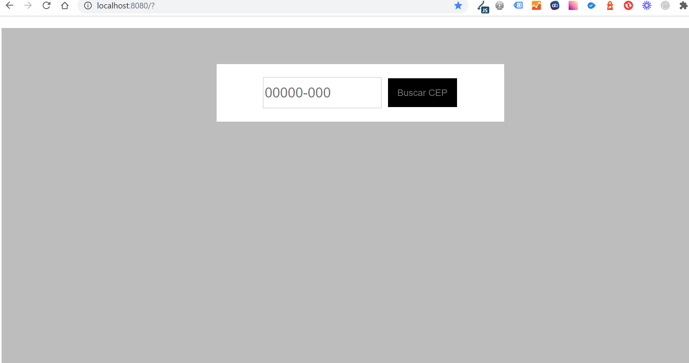
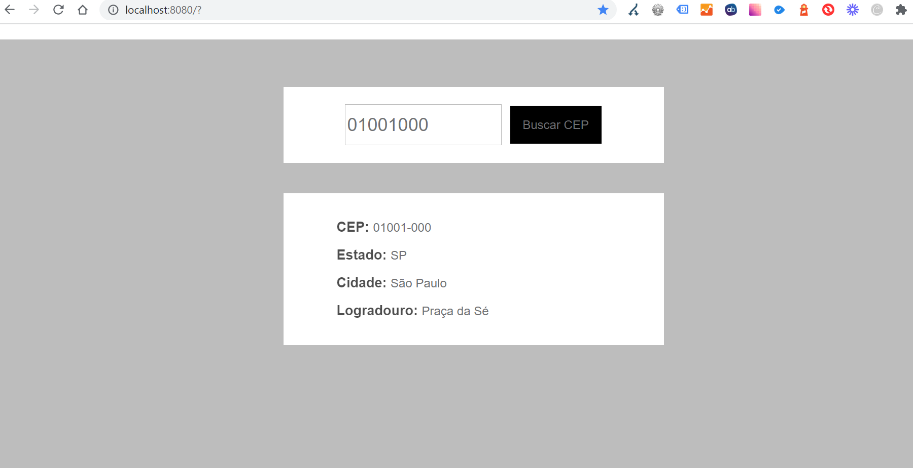
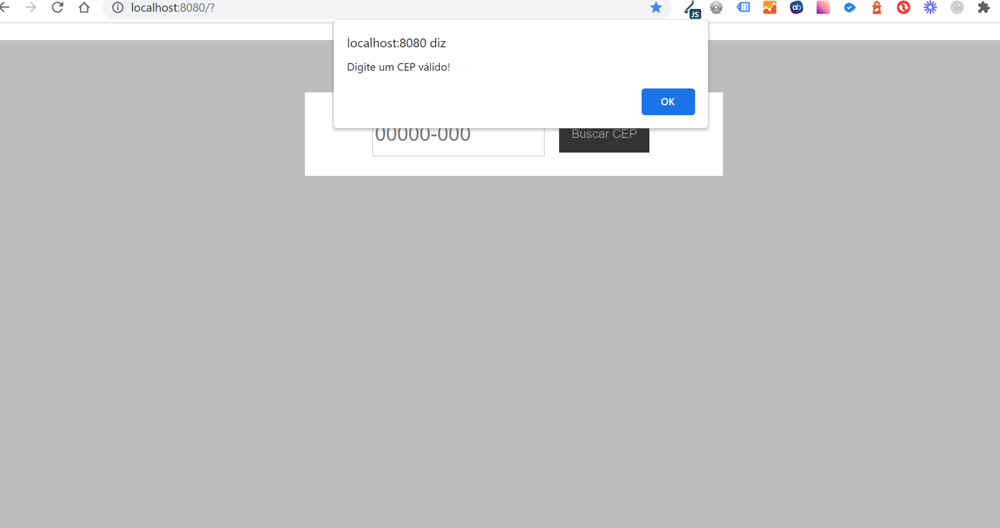

# FRONTEND - CEP_FORM

> README com instruções de como rodar o frontend do projeto.

## Table of Contents

- [General Info](#general-information)
- [Technologies Used](#technologies-used)
- [Screenshots](#screenshots)
- [Setup](#setup)
- [Usage](#usage)
- [Contact](#contact)

## General Information

- Projeto de front simples com o intuito de se conectar com uma API local na porta 3000,
  que faz uma consulta na no endpoint: http://localhost:3000/ ,
  faz um parse da resposta e disponibiliza um resumo das informações.

## Technologies Used PROD

- VUE CLI PUGLIN UNIT JEST - version 4.5.14
- V-MASK - version ^2.3.0
- CORE-JS: version ^3.6.5
- VUE - version ^2.6.11
- VUE-SPINNER - ^1.0.4

## Technologies Used PROD DEV

- VUE-CLI-PLUGIN-BABEL - version ~4.5.0
- VUE-PLUGIN-ESLINT - version ~4.5.0
- VUE-CLI-SERVICE - version ~4.5.0
- VUE-TEST-UTILS - version ^1.2.2
- BABEL-ESLINT - version ^10.1.0
- ESLINT - version ^6.7.2
- ESLINT-PLUGIN-VUE - version ^6.2.2
- VUE-TEMPLATE-COMPILER - ^2.6.11

## Screenshots

DEFAULT HOME APP

VALID REQUEST

INVALID REQUEST

## Setup

Este projeto é baseado em VUE, caso ainda não tenha instaldo em sua maquina ou não tenha familiaridade
veja o link: https://br.vuejs.org/v2/guide/installation.html .

Baixe o projeto e do GitHub em sua maquina local  

HTTPS - `git clone https://github.com/caiqueubasp/cep_form.git`  
SSH - `git clone git@github.com:caiqueubasp/cep_form.git`  

Após baixar com o GIT, instale as dependencias:

dependencias gerais: `npm install`
dependencias em DEV: `npm i -D`

## Usage

Este projeto roda na porta 8080 como padrão, então deixa a mesma disponivel no momento que for rodar o projeto  

para rodar o servidor digite no terminal:  

`npm run server`

Para rodar os tests rode o comando:

`npm run test`

## Utils Links

- VUE UTILS COM JEST: https://vue-test-utils.vuejs.org/installation/#using-vue-test-utils-with-jest-recommended
- V-MASK: https://www.npmjs.com/package/v-mask
- VUE-SPINNER: https://www.npmjs.com/package/vue-spinner
- ESLINT: https://eslint.vuejs.org/user-guide/#installation

## Contact

Created by [@caiqueubasp] - feel free to contact me!
LinkedIn: https://www.linkedin.com/in/caique-souza-00072669/
GITHUB: https://github.com/caiqueubasp

### Customize configuration

See [Configuration Reference](https://cli.vuejs.org/config/).

<!-- /////////////////////////////////////// -->
